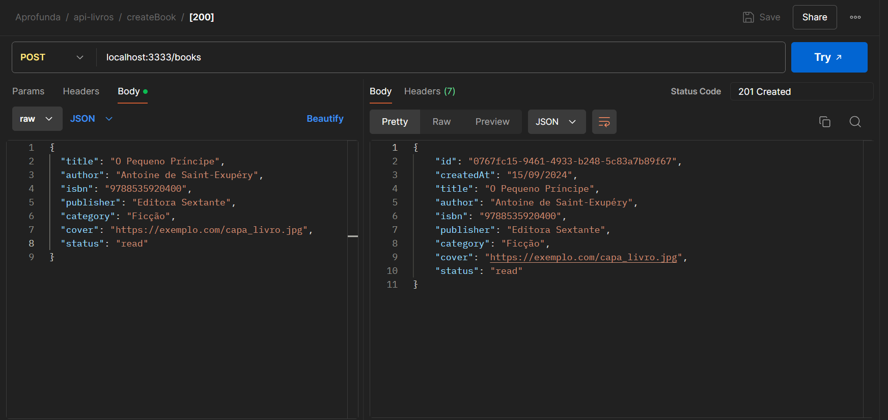
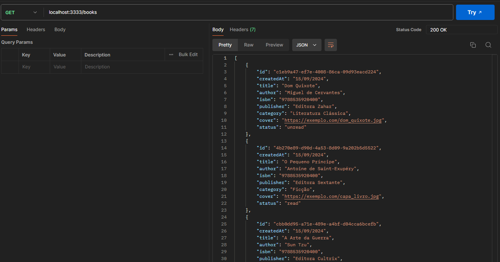

# Projeto Api de livros 📖 

### Exemplos de  testes
#### POST

#### GET ALL

## Aprendizados da semana

 - Durante esta semana, foram abordados conceitos de Clean Architecture e TypeScript. Destacando a importância de separar as responsabilidades em camadas distintas para criar sistemas mais robustos e testáveis e a utilização de tipagem de para garantir a segurança do código e facilitar a manutenção.

